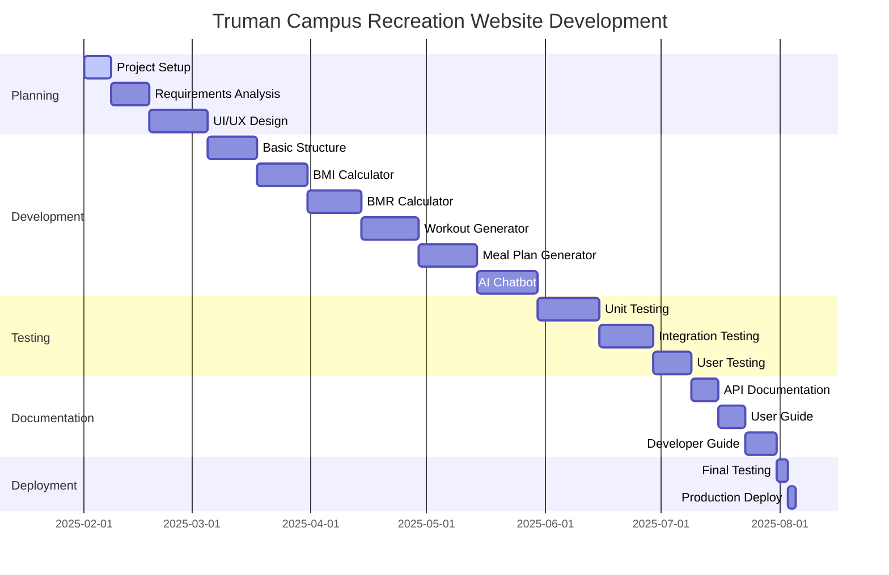

# Project Timeline 📅

## Gantt Chart

## Project Phases Breakdown

### 1. Planning Phase (Feb 1 - Feb 25)
- Initial project setup and repository creation
- Gathered requirements and feature specifications
- Designed user interface mockups
- Created project architecture

### 2. Development Phase (Feb 20 - Apr 5)
- Set up basic project structure and dependencies
- Implemented core calculators (BMI/BMR)
- Developed workout generation system
- Created meal planning functionality
- Integrated AI chatbot capabilities

### 3. Testing Phase (Mar 25 - Apr 20)
- Conducted unit testing of individual components
- Performed integration testing
- Gathered user feedback and made improvements
- Fixed bugs and optimized performance

### 4. Documentation Phase (Apr 15 - Apr 28)
- Created comprehensive API documentation
- Wrote user guides and tutorials
- Developed technical documentation
- Set up project wiki

### 5. Deployment Phase (Apr 25 - Apr 30)
- Conducted final testing and quality assurance
- Deployed to production environment
- Monitored system performance
- Made final adjustments

## Key Milestones 🏆

1. ✅ Project Kickoff (Feb 1)
2. ✅ Basic Structure Complete (Mar 5)
3. ✅ Core Features Implemented (Mar 30)
4. ✅ Testing Complete (Apr 20)
5. ✅ Documentation Complete (Apr 28)
6. ✅ Production Launch (Apr 30)

## Technologies Used 🛠️

- Frontend: HTML5, CSS3, JavaScript
- Backend: Python (Flask)
- AI Integration: Claude API
- Testing: Jest, Pytest
- Documentation: GitHub Wiki
- Deployment: Render

## Team Members 👥

- Frontend Developers
- Backend Developers
- UI/UX Designers
- QA Engineers
- Technical Writers
