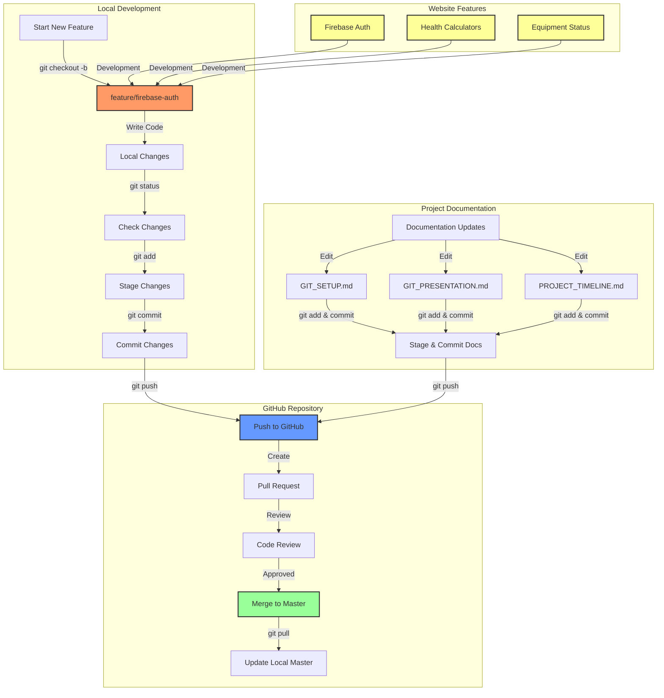

<div align="center">


# 🏋️‍♂️ Truman Campus Recreation Center 🏃‍♀️

[](https://github.com/Ashikvk18/truamn/blob/main/LICENSE)
[](https://github.com/Ashikvk18/truamn/pulls)
[](https://firebase.google.com/)
[](https://nodejs.org/)

*A modern web platform for Truman State University's Recreation Center, featuring real-time equipment tracking and staff management.*

[Features](#features) • [Live Demo](#live-demo) • [Tech Stack](#tech-stack) • [Contributing](#contributing)

</div>

---

## ✨ Features

🎯 **Real-time Equipment Status**
- Live tracking of gym equipment availability
- Staff dashboard for instant updates
- Equipment categorization and filtering
- Historical status tracking

🔐 **Secure Staff Portal**
- Firebase Authentication integration
- Role-based access control
- Secure data transmission
- Session management

🎨 **Modern UI/UX**
- Truman State's signature purple theme
- Responsive design for all devices
- Intuitive navigation system
- Smooth animations and transitions

📊 **Fitness Tools**
- BMI Calculator with health insights
- Workout tracking capabilities
- Progress visualization
- Personalized recommendations

## 🚀 Getting Started

## 🚀 Quick Start

1. **Clone and Install**
   ```bash
   # Clone the repository
   git clone https://github.com/Ashikvk18/truamn.git
   cd truamn

   # Install dependencies
   npm install
   ```

2. **Configure Firebase**
   ```bash
   # Copy the example env file
   cp .env.example .env

   # Add your Firebase configuration
   # Edit .env with your Firebase credentials
   ```

3. **Start Development Server**
   ```bash
   npm start
   ```

   Visit `http://localhost:4001` to view the application.

## 🛠 Tech Stack

- **Frontend**
  - HTML5, CSS3, JavaScript
  - Bootstrap 5
  - Custom animations

- **Backend**
  - Firebase Realtime Database
  - Firebase Authentication
  - Node.js server

- **Development**
  - Git workflow
  - ESLint
  - Prettier

## 📑 Key Pages

- `/`: Homepage with equipment status
- `/worker/login.html`: Staff login portal
- `/worker/dashboard.html`: Equipment management
- `/bmi.html`: BMI calculator

## 📂 Project Structure

```bash
rec-website/
├── public/           # Static assets
│   ├── images/      # Images and icons
│   ├── css/         # Stylesheets
│   └── js/          # Client-side scripts
├── worker/          # Staff portal
│   ├── login.html   # Authentication page
│   └── dashboard.html# Equipment management
├── js/              # Core JavaScript modules
│   ├── firebase-config.js
│   ├── worker-auth.js
│   └── dashboard.js
└── package.json     # Dependencies
```

## 📖 Documentation

### Git Workflow



### Project Documentation
- [Git Setup Guide](GIT_SETUP.md) - Guide for setting up Git
- [Project Timeline](PROJECT_TIMELINE.md) - Development timeline and milestones

## 🤝 Contributing

1. Fork the repository
2. Create your feature branch (`git checkout -b feature/AmazingFeature`)
3. Commit your changes (`git commit -m 'Add some AmazingFeature'`)
4. Push to the branch (`git push origin feature/AmazingFeature`)
5. Open a Pull Request

## 📝 License

This project is licensed under the MIT License - see the [LICENSE](LICENSE) file for details.

## 🙏 Acknowledgments

- Truman State University Recreation Center Staff
- Firebase Team for their excellent documentation
- All contributors who help improve this platform

---

<div align="center">

Made with 💜 for Truman State University

</div>
