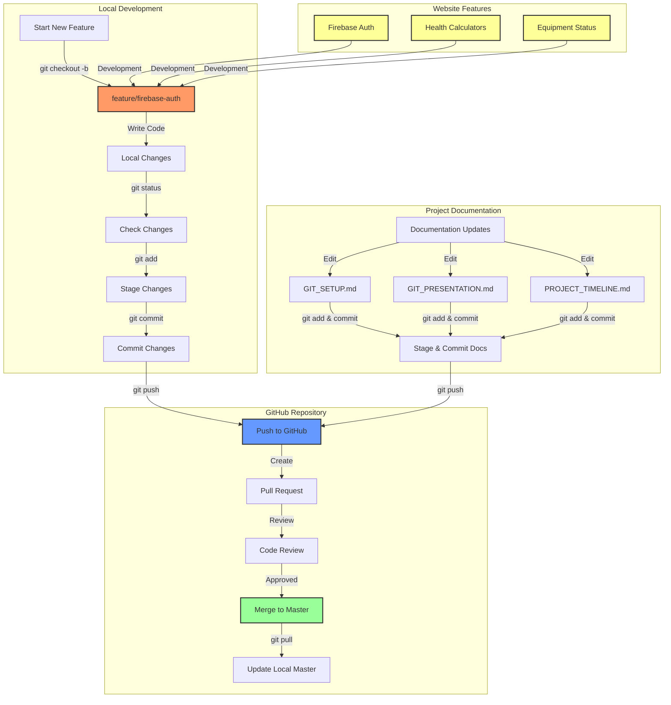

# Git Workflow Diagram

```mermaid
graph TD
    %% Development Flow
    subgraph Local Development
        A[Start New Feature] -->|git checkout -b| B[feature/firebase-auth]
        B -->|Write Code| C[Local Changes]
        C -->|git status| D[Check Changes]
        D -->|git add| E[Stage Changes]
        E -->|git commit| F[Commit Changes]
    end

    %% Remote Flow
    subgraph GitHub Repository
        F -->|git push| G[Push to GitHub]
        G -->|Create| H[Pull Request]
        H -->|Review| I[Code Review]
        I -->|Approved| J[Merge to Master]
        J -->|git pull| K[Update Local Master]
    end

    %% Documentation Flow
    subgraph Project Documentation
        L[Documentation Updates] -->|Edit| M[GIT_SETUP.md]
        L -->|Edit| N[GIT_PRESENTATION.md]
        L -->|Edit| O[PROJECT_TIMELINE.md]
        M & N & O -->|git add & commit| P[Stage & Commit Docs]
        P -->|git push| G
    end

    %% Website Components
    subgraph Website Features
        Q[Firebase Auth] & R[Health Calculators] & S[Equipment Status] -->|Development| B
    end

    %% Styles
    style B fill:#f96,stroke:#333,stroke-width:2px
    style G fill:#69f,stroke:#333,stroke-width:2px
    style J fill:#9f9,stroke:#333,stroke-width:2px
    style Q fill:#ff9,stroke:#333,stroke-width:2px
    style R fill:#ff9,stroke:#333,stroke-width:2px
    style S fill:#ff9,stroke:#333,stroke-width:2px
```
